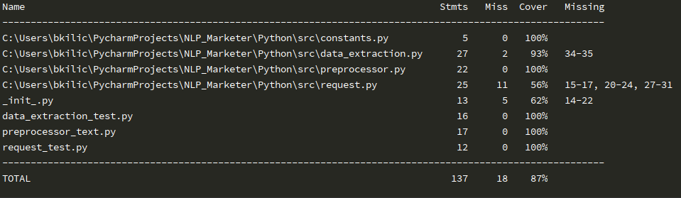

<h1>Extracting Adjectives and Numbers - NLP</h1>

<h2>Explanation</h2>
The project goal is to extract some entities, part of the speech tags, and numbers. Regarding that, 
I have five different pipelines. In the following sections, I will try explain them briefly.

* Data collection
* Data preprocessing
* Machine learning / NLP
* Data postprocessing / visualization
* Server

<h4> Data Collection</h4>
This section is the initiator of the entire application, we obtain our data and software technical requirements to properly work, from clients and/or other resources.
As an input, we have three different but correlated text input.

As an input, we have three different but correlated text input.

* The descriptions of the apartments (could be either batch process or parallel processing as well, but for simplicity, I went for single processing.)
* The string JSON input contains, nouns of interests that we are looking for in the given text input. Since this file has a dynamic nature and can be changed in the future by adding more nouns of interests, or properties, I have built the system according to the extensibility requirement, as requested.
* Our final parameter is the name of the machine learning model to determine, which precise level that we want to process our input document with NLP. SpaCy has three built-in English models (sm, md, lg), which are not marginally different by results, but by size. An increased size reduces performance and takes a longer time to process. Thus, for the demonstration purposes, I choose the small model.

<h4> Data Preprocessing</h4>

In almost all machine learning processing steps, the quality of the data is the most important aspect. It affects the quality, F scores, and other similarity matrices.

Depending on the aim, the pre-processing stage usually includes cleaning the unnecessary tokens, punctuations, stop words, etc. In this problem, I only applied to lower the text variables and to demonstrate that it is part of the NLP.

<h4>Machine Learning / NLP</h4>

In this part, as I previously mentioned before, I used the SpaCy library. The reason for that is SpaCy has been built with the mindset of a production-ready framework that can be used in many NLP applications. Built-in functions and models, made me go through faster and focus on data processing pipelines more in order to have control over the errors and missing data entries.

As you can see from the results, the extracted variables are not so accurate but decent level. This process can be improved in many ways, respectively using large data sets and training on-purpose models to be used for more complex operations.

On the other hand, for very complex data structures, or even unstructured data sets, it is doable to create Deep Learning algorithms by using TensorFlow/Pytorch as well. However, based on my experience, for many tasks, unless there is an extensive amount of data (such as Medical/Clinical data sets, genomic data, etc.) Tensorflow could be an overkill.

<h4>Data postprocessing & Server</h4>
In this process, I finalize how the data will be re-presented(Format, style, etc.) and how it is going to be visualized, after all the previous processing steps.

As it is requested, for each property, I present the extracted information for each noun category (the keys of the dictionary), in the same JSON format.

By using the Flask framework, built the development server, and created an endpoint to be able to send a request. It is a RestAPI server. I have also added basic auth service to demonstrate the accessing rights to the server. However, I did not take security into account that much. Thus, the credentials are available in the code.

Flask is a very fast and robust framework to create quick POC (Proof of Concepts) but as well as production-ready codes by, wrapping it with stronger back-end services such as WSGI, Nginx, Waitress etc.


<h2>Limitations</h2>

<li>I found the explanations of the problem a little bit confusing. Thought, it would be easier to handle the problem with a supporting engineer and/or business person to guide the given problem.</li>

<li>I have used pre-trained models, therefore the accuracy of the adjectives, numbers, and noun-chunks is relatively low. My main goal was to demonstrate the basic natural language processing application and data processing pipelines accordingly.</li>

<h2>Execution Guidelines</h2>
PyCharm Environment: 2019.3.3

Python version: 3.7.4

Installing the external libraries used:
```
$ pip install requirements.txt
```
Execution of the scripts:
```
$python flask_server.py
```
<h4>Results</h4>


Postman call results:


Example response - Property 1:
```
{
    "bathroom": [
        "two bathrooms"
    ],
    "bedroom": [
        "two bedroom apartment",
        "two bedrooms"
    ],
    "living room": [
        "the reception areas",
        "a generous reception space"
    ],
    "property": [
        "two bedroom apartment",
        "the apartment",
        "flexible accommodation",
        "spacious accommodation"
    ],
    "garden": [
        "this historic garden square",
        "garden square location"
    ],
    "location": [
        "central london location",
        "garden square location"
    ]
}
```
<h4>Document Similarity Matrix Example:</h4>
Cosine Similarity

I choose to use Cosine Similarity as it is widely used for text, email, document similarities. Also, it fits our case, 
Basically, it calculates the angle of th 2 vectors, relatively giving accurate results compare to other techniques, such as Euclidean Distance.
   ```
[[1.         0.29279489 0.22831483 0.30326056 0.24329198]
 [0.29279489 1.         0.25685982 0.34642448 0.32510743]
 [0.22831483 0.25685982 1.         0.25434691 0.26606626]
 [0.30326056 0.34642448 0.25434691 1.         0.55800652]
 [0.24329198 0.32510743 0.26606626 0.55800652 1.        ]]
```
Obviously, there are many more ways to calculate the similarity matrix, from various libraries, pre-trained models, such as
Gensim, Fasttext, NLTK, BERT model, etc. 


For a generous source with explanations:

https://towardsdatascience.com/overview-of-text-similarity-metrics-3397c4601f50


<h4>Testing results:</h4>
```
$ coverage run -m unittest _init_py.
$ coverage report -m
```




<h1>Thank you.</h1>

